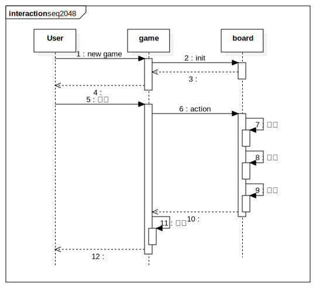

# Julia-2048
practice Julia Lang

## reference
[2014 iT 邦幫忙鐵人賽](https://ithelp.ithome.com.tw/users/20091968/ironman/970)

[wiki 2048](https://zh.wikipedia.org/wiki/2048)

[play 2048](http://gabrielecirulli.github.io/2048/)

[source code-2048](https://github.com/gabrielecirulli/2048)

## structure
* game: 接受指令、輸出、流程控制
* board: 處理棋盤
    * 初始化棋盤狀態
    * 執行指令、運算
    * 計算分數

